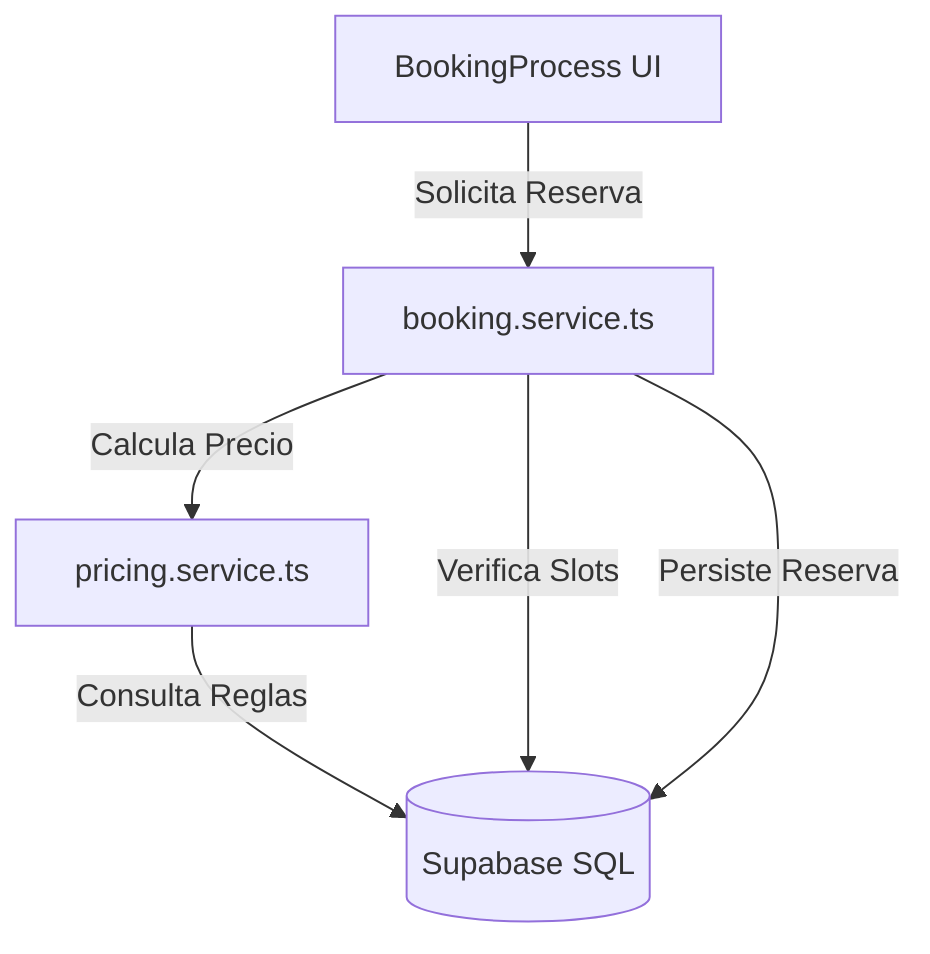

# Walkthrough: Fase 1 - Cimentación Técnica 🧱
Se ha completado la transición de un sistema basado en mocks estáticos a una arquitectura de servicios preparada para el mercado real y Supabase.
## Cambios Realizados
### 1. Tipado Profesional (UUID & Real Schema)
- **[parking.types.ts](file:///root/TFG/app/src/features/parking/types/parking.types.ts)**: Se ha migrado el `id` a `string` (UUID) y se han añadido los campos reales (`base_price_per_hour`, `garage_id`, etc.) que coinciden con tu esquema de Supabase.
- **[booking.types.ts](file:///root/TFG/app/src/features/booking/types/booking.types.ts)**: Nueva interfaz para gestionar el estado de las reservas, reglas de precio y slots de disponibilidad.
### 2. Motor de Precios Dinámicos (`pricing.service.ts`)
Ubicación: `app/src/features/booking/services/pricing.service.ts`
- Implementa la lógica para aplicar multiplicadores automáticos.
- Permite calcular presupuestos basados en reglas de prioridad (ej. fin de semana > base).
### 3. Integración con Supabase (`booking.service.ts`)
Ubicación: `app/src/features/booking/services/booking.service.ts`
- **`getPricingRules`**: Recupera las reglas activas de la DB.
- **`checkAvailability`**: Verifica slots de tiempo real para evitar solapamientos.
- **`createBooking`**: Realiza la transacción de reserva inyectando los precios pactados para seguridad financiera.
## Estado de la Arquitectura

## Próximos Pasos Recomendados
1.  **Refactorizar `BookingProcess.tsx`**: Sustituir las constantes locales de precio por llamadas al `pricingService`.
2.  **Carga de Datos Reales**: Empezar a sustituir los `parkingData` del state por consultas reales a la tabla `parking_spots`.